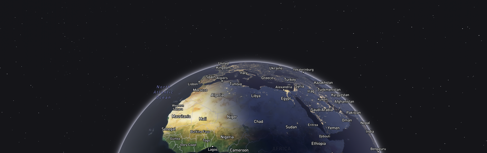

## mapbox-gl-terminator

This package enables the rendering of a solar terminator on a map created with Mapbox GL JS

### Usage

To render the solar terminator, you add a `TerminatorSource` to your map together with the corresponding raster layer.

```typescript

import { TerminatorSource } from '@vicmartini/mapbox-gl-terminator';

...

const is2x = window.devicePixelRatio > 1;
const tileSize = 256;
const tileURL = `https://api.mapbox.com/v4/rreusser.black-marble/{z}/{x}/{y}.webp?sku={sku}&access_token=${window.ENV.MAPBOX_TOKEN}`;

const terminatorRenderer = new TerminatorSource({
  date: Date.now(),
  tileSize,
  is2x,
  stepping: 0,
  fadeRange: [6, -6],
  fetchTileImageBitmap: async function (zxy: string) {
    const sku = map._requestManager._skuToken;

    const response = await fetch(
      tileURL
        .replace('{z}/{x}/{y}', zxy)
        .replace('{sku}', sku)
        .replace('.webp', is2x ? '@2x.webp' : '.webp')
    );
    if (!response.ok) throw response.body;
    return await createImageBitmap(await response.blob());
  },
});
map.addSource('solar-terminator', terminatorRenderer as AnySource);

```

## Credits

This package is based on this amazing demo created by @rreusser:
https://github.com/rreusser/maps/tree/main/night-and-day
